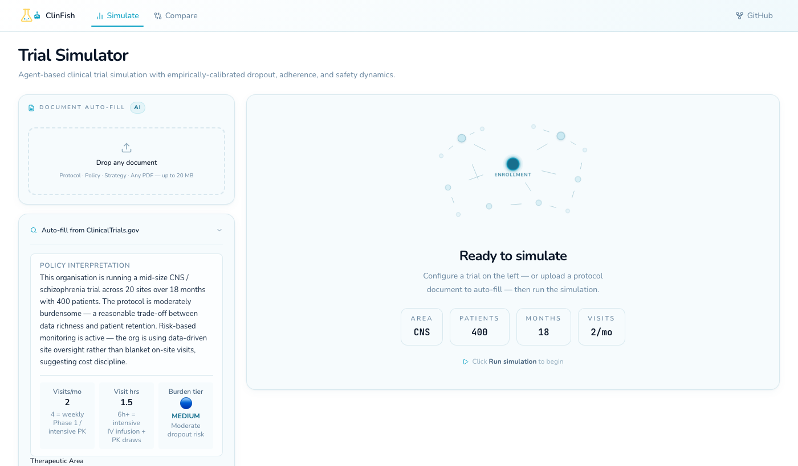
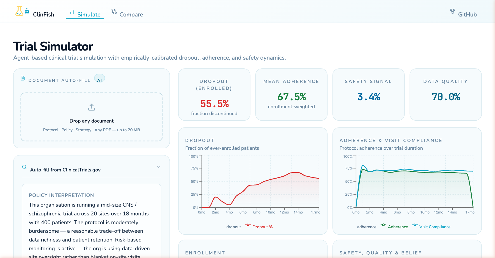
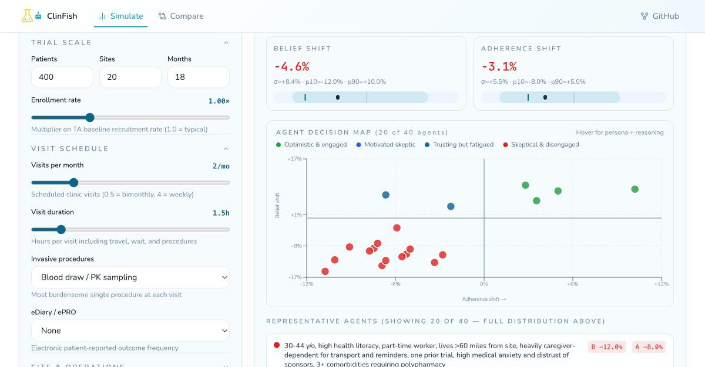

<div align="center">
  

  <h1>ClinFish</h1>

  <p>A behavioral simulation engine for clinical trials.<br/>
  Model enrollment, dropout, adherence, and site dynamics — grounded in published clinical literature.</p>

  [](LICENSE)
  [](https://github.com/Ambar-13/ClinFish/releases/tag/v1.0)
  [](https://python.org)
  [](https://fastapi.tiangolo.com)
  [](https://nextjs.org)
</div>

Clinical trials fail in predictable ways. Enrollment falls behind. Patients drop out earlier than anticipated. Sites that looked great on paper activate months late and enroll almost nobody. These failures are expensive — and many of them could have been caught with a better model.

ClinFish is a simulation engine that tries to capture this. It models individual patients (not just averages), realistic site activation timelines, social network effects on belief and trust, and the behavioral personality traits that actually predict whether someone finishes a trial. Every number in the model is tagged with how confident we are in it — grounded in data, directional from theory, or just an assumption that needs testing.

---







---

## Who is this for

ClinFish is useful anywhere someone needs to reason about what happens *inside* a trial before, during, or after it runs.

**Sponsors and pharma teams** — feasibility before a protocol is locked, enrollment forecasting, stress-testing site strategies, understanding what drives dropout in a specific therapeutic area.

**CROs and site networks** — modeling recruitment timelines across site activation scenarios, evaluating decentralized trial designs, comparing site count vs. patient support tradeoffs.

**Biostatisticians and trial methodologists** — simulation-based sample size planning that accounts for realistic dropout patterns rather than flat assumptions, sensitivity analysis around behavioral parameters.

**Academic researchers** — anyone studying trial design, patient adherence, health behavior, social network effects in healthcare, or longitudinal dropout mechanisms. The model is fully readable and every assumption is documented.

**Health psychologists and behavioral scientists** — the patient archetype system, Big Five personality model, dual belief dynamics, and social network propagation are designed to be extended. ClinFish gives a working simulation harness for behavioral theories.

**Protocol designers and medical writers** — quickly translating a draft protocol into a simulation to see whether the visit schedule, eligibility criteria, or AE monitoring burden create retention problems before the protocol goes to IRB.

**Digital health and DCT teams** — modeling the impact of decentralized design choices (eConsent, remote visits, eDiary frequency) on adherence and dropout.

**Healthcare economists and outcomes researchers** — trial failure costs money and delays access to treatments. ClinFish can model the downstream impact of design decisions on timeline and completion probability.

**Educators** — the codebase is a concrete implementation of competing-risks survival, DeGroot belief dynamics, stock-flow conservation, and SMM calibration. Useful as a teaching tool for advanced trial methodology or health systems modeling courses.

**Developers building clinical tools** — open API, Apache 2.0 license. Use it as a backend for feasibility dashboards, protocol optimization tools, or trial planning platforms.

ClinFish is not a regulatory submission tool — it is built to simulate.

---

## Table of Contents

- [How it works](#how-it-works)
- [Key concepts](#key-concepts)
- [Getting started](#getting-started)
- [Running the UI](#running-the-ui)
- [Patient archetypes](#patient-archetypes)
- [The epistemic tagging system](#the-epistemic-tagging-system)
- [Calibration](#calibration)
- [NCT auto-fill](#nct-auto-fill)
- [Sponsor policy layer](#sponsor-policy-layer)
- [REST API](#rest-api)
- [Project structure](#project-structure)
- [References](#references)
- [License](#license)

---

## How it works

Each simulation runs in monthly rounds. In every round:

1. **Enrollment** — new patients are drawn from a Poisson process at each active site, gated by how many sites have cleared their activation pipeline.
2. **Belief propagation** — patients talk to each other. A DeGroot averaging model updates each patient's health belief and trial trust based on their social network neighbors.
3. **Behavioral decisions** — for each enrolled patient, the model computes their adherence probability, visit compliance, and adverse event reporting rate. These are functions of their personality, visit burden, AE load, and institutional trust.
4. **Dropout** — patients can drop out for four reasons (lack of efficacy, intolerability, personal decision, administrative), each with its own hazard. Cause is assigned by competing risks (Beyersmann et al., *Statistics in Medicine*, 2009).
5. **Stock updates** — all patient state is tracked in conservation-checked stocks. At every round, Screened + Enrolled + Dropout + Completed = N_total. If this fails, the simulation throws.

The main simulation loop is vectorized with numpy — all 500–5000 patients are processed in parallel float32 arrays, giving 20–50x speedup over patient-by-patient Python loops.

---

## Key concepts

### Competing-risks dropout

Most trial simulators model dropout as a single event. ClinFish separates it into cause-specific hazards drawn from CATIE Phase 1 (Lieberman et al., *NEJM*, 2005; n=1,493): efficacy failure (24%), intolerability (15%), patient decision (30%), administrative (5%), non-medical (26%). The total hazard drives the dropout timing; the cause proportions drive which bucket the patient lands in.

The dropout time distribution uses Weibull survival, with shape parameter κ calibrated per therapeutic area. Empirical anchors: AVID trial (cardiology, κ=0.70), MADIT-II (κ=1.01), SCD-HeFT (κ=1.08), pediatric oncology (κ=1.37, SE=0.28). For trials longer than 12 months, κ > 1 is the more empirically likely regime.

### Social belief dynamics

Patients share experiences through a social network. The model uses DeGroot (1974) opinion dynamics — each patient's belief is a weighted average of their own belief and their network neighbors' beliefs. Stubbornness (the weight placed on one's own prior belief) varies by archetype: high-anxiety patients update faster; advocates are more stubborn.

This matters because belief predicts adherence through a stochastic bridge: TPB meta-analysis (Rich et al., 2015; 27 studies) puts the intention-to-behavior R² at only 0.09. So even a confident patient will miss doses. The belief state shifts the probability; it doesn't determine the outcome.

### Dual belief model

Patients hold two separate belief states that update at different speeds:

- **Efficacy belief** — updated fast, driven by adverse events and symptom signals. Timescale: weeks to a few months.
- **Institutional trust** — updated slowly, driven by sponsor signals (protocol amendments, communication quality, data transparency). Timescale: months to years.

Trust decays quickly (τ_decay = 3 months) but recovers slowly (τ_recovery = 12 months). This asymmetry is grounded in behavioral economics research on trust repair (Kim et al., 2004; *Academy of Management Review*) and health-specific findings from Shi et al. (2023, PMC10015300).

### Site activation pipeline

Sites don't just appear — they go through contracting, IRB review, and readiness checks before they can enroll anyone. The model uses a three-stage Erlang delay (DELAY3) with total mean activation time of 5.6 months, derived from NCI cancer center data (AACI/NCI, 2018: median 167 days from site selection to first patient enrolled; observed range 78–313 days). The DELAY3 structure gives a more realistic peaked distribution of activation times than a single exponential would.

### Personality traits

Three Big Five traits meaningfully predict medication adherence and are included in the model:

- **Conscientiousness** — the strongest predictor. Molloy et al. (2014, *Annals of Behavioral Medicine*; 16 studies, n=3,476) found r=0.149 for medication adherence specifically. With 50% archetype overlap correction, β_C = 0.08.
- **Neuroticism** — associated with lower adherence. Axelsson et al. (*West Sweden Study*, PMC3065484) found β=−0.029 in a multivariate model. ClinFish uses β_N = 0.05.
- **Personal Control (IPQ-R)** — illness-specific perceived controllability. Brandes & Mullan (2014, *Health Psychology Review*; 30 CSM studies) found r=0.12 for adherence. β_PC = 0.06.

Openness, Agreeableness, and Extraversion are excluded. The evidence for their direct adherence effects is too weak to justify the added dimensionality.

---

## Getting started

**Requirements:** Python 3.11+, pip.

```bash
git clone https://github.com/Ambar-13/ClinFish.git
cd ClinFish
pip install -e ".[dev]"
```

Run the test suite to confirm everything is working:

```bash
pytest tests/ -v
```

All four test modules should pass — conservation, behavioral, calibration, and extreme conditions.

Start the API:

```bash
uvicorn api.main:app --reload
```

The API docs are at `http://localhost:8000/docs`.

**Quick simulation via Python:**

```python
from clinfish.core.engine import run_simulation, SimConfig

config = SimConfig(
    n_patients=500,
    n_rounds=24,          # 24 months
    therapeutic_area="oncology",
    target_enrollment=300,
)
result = run_simulation(config)

print(f"Enrolled:   {result.final_enrolled}")
print(f"Dropout:    {result.final_dropout}")
print(f"Completed:  {result.final_completed}")
print(f"Median dropout month: {result.median_dropout_month:.1f}")
```

---

## Running the UI

The frontend requires Node.js 18+.

```bash
cd frontend
npm install
npm run dev
```

Open `http://localhost:3000`. The UI lets you configure a trial, run the simulation, and see enrollment curves, site activation ramp, adherence trajectories, and dropout breakdown — all in one dashboard.

You can also compare two scenarios side by side (e.g., standard protocol vs. decentralized design) from the `/compare` route.

---

## Patient archetypes

Rather than drawing patients from a featureless distribution, ClinFish synthesizes five archetypes that reflect documented variation in trial populations:

| Archetype | Description | Key traits |
|---|---|---|
| **Treatment-Naive, High Anxiety** | First-time trial participant; responds strongly to AEs and peer signals | High N (0.72), moderate C (0.55), low PC (0.35) |
| **Experienced Advocate** | Has been in trials before; stubborn believer in clinical research | Low N (0.25), high C (0.80), high PC (0.75) |
| **Caregiver-Dependent Elderly** | Relies on family or caregiver for logistics and decisions | Moderate N (0.52), moderate C (0.60) |
| **Low-Access Rural** | Faces geographic and structural barriers to participation | Distance is the primary dropout driver |
| **Motivated Young Adult** | Self-managed, digitally engaged, high health literacy | Low N (0.28), high C (0.75), high PC (0.72) |

Archetype proportions are configurable. Defaults reflect therapeutic-area-specific enrollment patterns drawn from Milken Institute (2022) geographic access data, NCES health literacy distributions (Kutner et al., 2003), and Donohue et al. (2020) age-dropout interaction from the A4 Study (n=4,486; OR=1.06 per year, 95% CI 1.03–1.09).

---

## The epistemic tagging system

Every numerical constant in the behavioral model carries one of three tags:

**`[GROUNDED]`** — the value comes directly from a published figure, with citation. These are the numbers you can argue about in a regulatory context.

**`[DIRECTIONAL]`** — the sign and rough magnitude are supported by literature, but the exact value is estimated. Worth sensitivity-testing but unlikely to be qualitatively wrong.

**`[ASSUMED]`** — no strong empirical anchor. The docstring names the range for the sensitivity sweep.

This tagging system is what makes ClinFish auditable. The epistemic status of every parameter is explicit in the source — not buried in a config file or assumed away.

---

## Calibration

ClinFish uses Simulated Method of Moments (SMM) calibration, following Lamperti, Roventini & Sani (*Journal of Economic Dynamics and Control*, 2018, Vol. 90, pp. 366–389). The approach:

1. **Latin hypercube sampling** — draw 200–500 parameter vectors from the prior space.
2. **Simulate** — run the vectorized simulator at each draw and compute six target moments (enrollment velocity, dropout rate, adherence mean/variance, site activation curve, AE rate).
3. **Fit MLP surrogate** — train a 64-64-32 neural network on the (θ, moments) pairs.
4. **Nelder-Mead on surrogate** — optimize the SMM objective on the surrogate (~microseconds per eval vs. ~2s for the real simulator).
5. **Confirm top candidates** — re-run the best five parameter vectors on the real simulator to validate.

The SMM objective is:

```
J(θ) = (m_sim(θ) − m_target)ᵀ W (m_sim(θ) − m_target)
```

where `W = diag(1/SE²)`. Well-measured moments pull the optimizer harder than noisy ones.

Model fit is assessed with Theil's inequality decomposition (Theil, 1961; Sterman JD, *Dynamica*, 1984, Vol. 10): a well-calibrated model has bias (UM) and unequal-variation (US) components near zero, with unsystematic error (UC) dominating. This is a standard model validation procedure from the system dynamics literature (Barlas, 1996, *System Dynamics Review*, 12(3):183–210).

---

## NCT auto-fill

Pass an NCT ID and ClinFish will look up the trial on ClinicalTrials.gov (v2 API) and auto-populate the simulation config:

```bash
GET /simulate/nct/NCT04280705
```

Fields that cannot be reliably extracted from the registry are tagged `[ASSUMED]` in the response. The enrollment Poisson-Gamma model is validated against ClinicalTrials.gov completion data following Anisimov & Fedorov (*Statistics in Medicine*, 2007, PMID 17639505).

---

## Sponsor policy layer

The policy API accepts 15 strategic dimensions and translates them into concrete parameter adjustments:

```bash
POST /simulate/policy
{
  "patient_support_investment": 0.8,
  "protocol_complexity": 0.3,
  "burden_reduction_priority": 0.9,
  ...
}
```

Dimensions cover patient experience (support programs, digital health integration, site proximity), operations (monitoring intensity, amendment frequency, site count), science (enrichment strategy, adaptive design), and safety oversight (DSMB intensity, stopping conservatism).

Each mapping carries its own epistemic tag. For example, patient support investment has a `[GROUNDED]` direction (Milken Institute 2022 geographic access data; Tufts CSDD site activation benchmarks) but an `[ASSUMED]` linear scaling.

---

## REST API

The full interactive docs are at `/docs` after starting the server.

| Method | Endpoint | Description |
|---|---|---|
| `POST` | `/simulate` | Run a full simulation |
| `POST` | `/simulate/compare` | Run two configs and compare |
| `GET` | `/simulate/nct/{nct_id}` | Fetch NCT trial and build SimConfig |
| `POST` | `/simulate/policy` | Apply sponsor policy to SimConfig |
| `POST` | `/calibrate/run` | Run SMM calibration |
| `GET` | `/presets` | List built-in trial presets |
| `POST` | `/inject` | Add mid-trial interventions |
| `POST` | `/upload` | Upload a protocol document |

---

## Project structure

```
ClinFish/
├── clinfish/
│   ├── core/
│   │   ├── engine.py          # Main simulation loop
│   │   ├── vectorized.py      # Numpy patient population arrays
│   │   ├── network.py         # DeGroot social network
│   │   └── calibration/
│   │       └── smm.py         # SMM + MLP surrogate calibration
│   ├── domain/
│   │   ├── agents.py          # Patient archetypes + institutional actors
│   │   ├── response.py        # Adherence, dropout, AE response functions
│   │   └── stocks.py          # Stock-flow conservation model
│   └── ingest/
│       ├── nct.py             # ClinicalTrials.gov v2 API
│       └── policy.py          # Sponsor policy-to-parameter translation
├── api/
│   ├── main.py                # FastAPI application
│   └── routes/                # Endpoint implementations
├── frontend/                  # Next.js 15 dashboard
├── tests/                     # pytest suite (conservation, behavioral, calibration)
└── pyproject.toml
```

---

## References

The behavioral model is grounded in the following literature. Citations are repeated inline in the source docstrings of the relevant modules.

**Dropout and survival**
- Beyersmann J et al. Competing risks and multistate models. *Statistics in Medicine*. 2009;28(19):2368–81. DOI:10.1002/sim.3516
- Ganguly SS et al. Weibull competing-risks in clinical trial design. *Statistics in Medicine*. 2026. DOI:10.1002/sim.70466
- Lieberman JA et al. (CATIE). *New England Journal of Medicine*. 2005;353:1209–23.

**Enrollment and site activation**
- Anisimov VV, Fedorov VV. Modelling, prediction and adaptive adjustment of recruitment in multicentre trials. *Statistics in Medicine*. 2007;26(27):4958–75. PMID 17639505
- AACI/NCI. *Site Activation Benchmarks*. 2018. (Median 167-day activation time)
- Tufts CSDD. *Site Performance Benchmarks*. 2012 & 2019.

**Adherence and personality**
- Molloy GJ et al. Conscientiousness and medication adherence. *Annals of Behavioral Medicine*. 2014;47(1):92–101.
- Axelsson M et al. (West Sweden Study). Personality and adherence. *BMC Pulmonary Medicine*. 2013. PMC3065484
- Brandes M, Mullan B. Can the common-sense model predict adherence? *Health Psychology Review*. 2014;8(2):129–53. PMID 25053132
- Vrijens B et al. A new taxonomy for describing and defining adherence to medications. *BMJ*. 2012. PMC2386633

**Belief and social dynamics**
- DeGroot MH. Reaching a consensus. *Journal of the American Statistical Association*. 1974;69(345):118–21.
- Rich A et al. A systematic review of the theories used to explain treatment adherence. *Clinical Rehabilitation*. 2015. PMID 25994095
- Carpenter CJ. A meta-analysis of the effectiveness of health belief model variables in predicting behavior. *Health Communication*. 2010. PMID 21153982

**Institutional trust**
- Shi L et al. Pharmaceutical company trust among US adults. *JAMA Internal Medicine*. 2023. PMC10015300
- Kim PH et al. Removing the shadow of suspicion: The effects of apology versus denial for repairing competence- versus integrity-based trust violations. *Journal of Applied Psychology*. 2004;89(1):104–18.

**Health literacy and family support**
- Kutner M et al. *National Assessment of Adult Literacy*. NCES, 2003.
- Molloy GJ et al. Family support and adherence: a meta-analysis. *Health Psychology Review*. 2018. PMC7967873
- Milken Institute. *Obstacles and Opportunities in Clinical Trial Participation*. 2022.

**Protocol operations**
- Getz KA et al. Protocol amendment analysis. *Therapeutic Innovation & Regulatory Science*. 2024. PMID 38438658
- Krudys KM et al. Protocol deviations in Phase III. *Contemporary Clinical Trials Communications*. 2022. PMC8979478
- Donohue MC et al. Dropout prediction in the A4 Study. *Alzheimer's & Dementia*. 2020.

**Calibration and validation**
- Lamperti F, Roventini A, Sani A. Agent-based model calibration using machine learning surrogates. *Journal of Economic Dynamics and Control*. 2018;90:366–89.
- Sterman JD. Appropriate summary statistics for evaluating the historical fit of system dynamics models. *Dynamica*. 1984;10(Winter):51–66.
- Sterman JD. *Business Dynamics: Systems Thinking and Modeling for a Complex World*. McGraw-Hill, 2000.
- Barlas Y. Formal aspects of model validity and validation in system dynamics. *System Dynamics Review*. 1996;12(3):183–210.
- Forrester JW, Senge PM. Tests for building confidence in system dynamics models. *TIMS Studies in Management Sciences*. 1980;14:209–28.

**ICH regulatory framework**
- ICH E9(R1). *Addendum on Estimands and Sensitivity Analysis in Clinical Trials*. FDA, November 2019.

---

## License

Apache 2.0. See [LICENSE](LICENSE).
